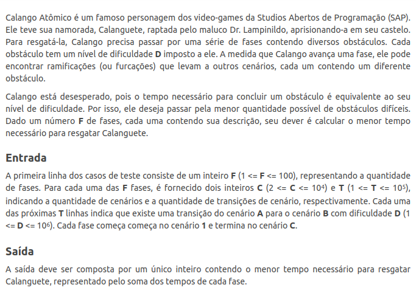
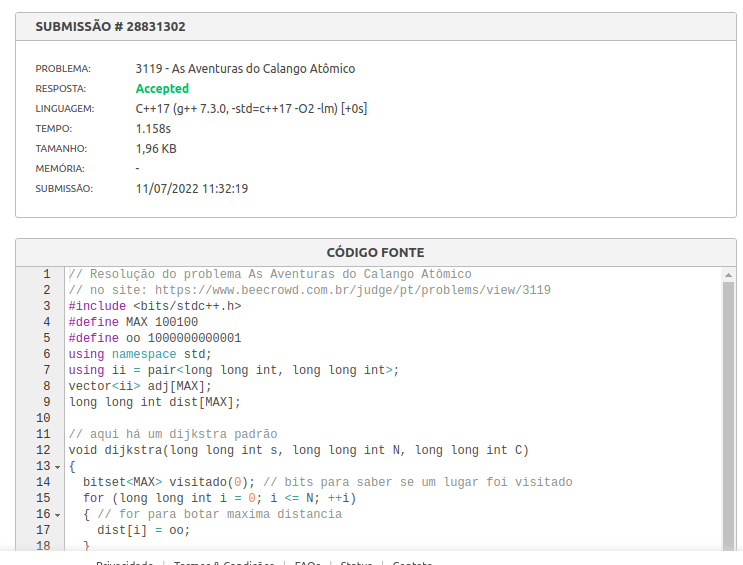
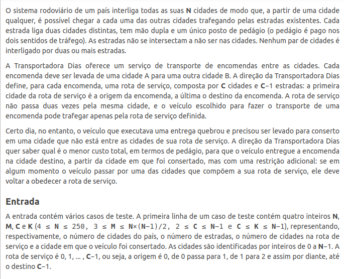
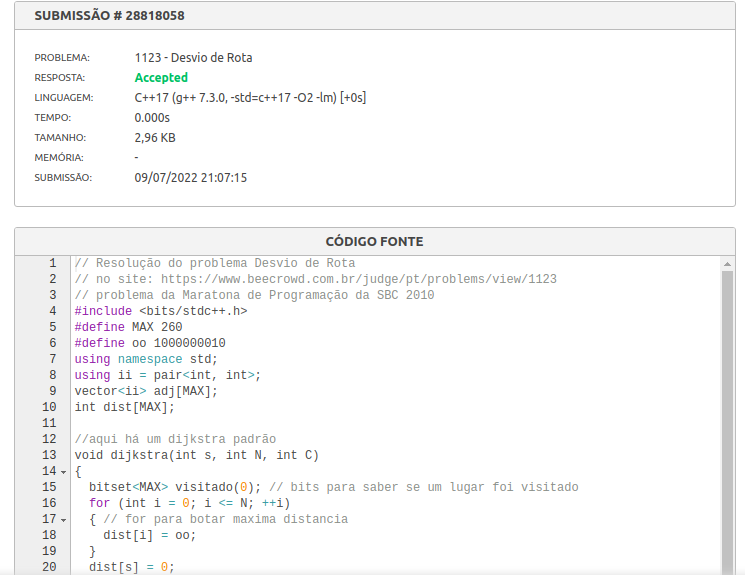
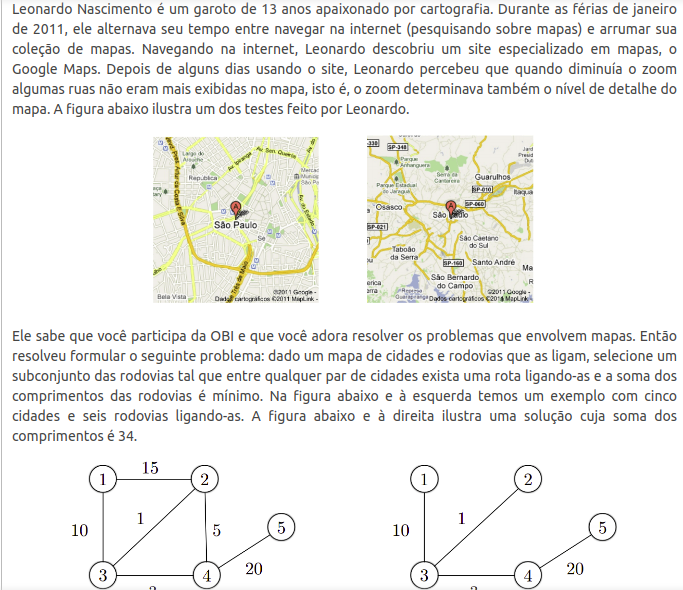
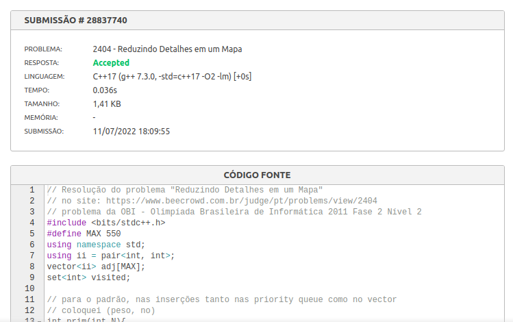
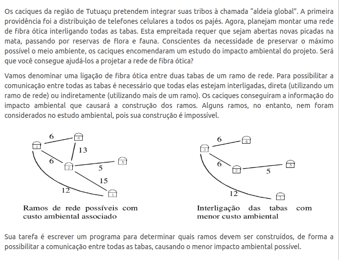
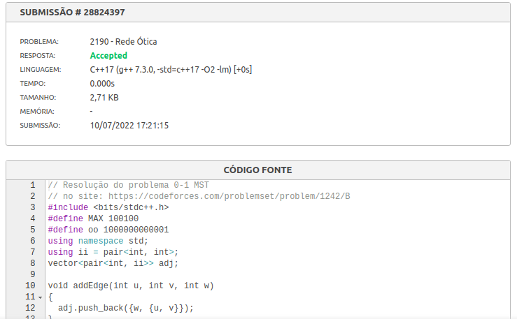

# Constest Problems

**Número da Lista**: 1<br>
**Conteúdo da Disciplina**: Grafos 2<br>

## Alunos
|Matrícula | Aluno |
| -- | -- |
| 18/0015834  |  Eliseu Kadesh Rosa Assunção Júnior |
| 18/0037242  |  Rodrigo Tiago Costa Lima |

## Sobre 
O projeto consiste em resolver problemas de maratonas/competições de programação. Para isso pesquisamos na plataforma [beecrowd](https://www.beecrowd.com.br/). Escolhemos tal plataforma, pois é mais simples encontrar problemas ligados a grafos nela.

## Instalação 
**Linguagem**: C++<br>

## Pré-requisitos:

- g++ >= 9.4.0;
- make >= 4.2.1;

## Uso 

Existem dois arquivos para cada questão, um .cpp para a compilação e outro .txt em que há algum caso de teste designado para a questão.

Para rodar qualquer uma das questões, primeiro entre na pasta da questão.

```
  cd ./nomeDaQuestão
```

Depois usando make compile o código da questão

```
  make build
```

Agora execute a questão com o binário gerado com o caso de teste exemplo.

```
  make run
```

ou simplesmente compile e rode com um só comando

```
  make
```

### As Aventuras do Calango Atômico - [link](https://www.beecrowd.com.br/judge/pt/problems/view/3119)



**Dificuldade:** 5

**Resolução:**

Esse problema tem sua dificuldade no fato de termos que somar o tempo que o Calango Atômico leva até chegar na Calanguete percorrendo algumas fases, visto que teremos um grafo por fase.
Utilizamos o algoritmo de Dijkstra para descobrir o menor tempo do nó 1 até o último nó em todos os grafos e então somamos os tempos e mostramos a solução. 

**Questão accepted**



### Desvio de Rota - [link](https://www.beecrowd.com.br/judge/pt/problems/view/1123)



**Dificuldade:** 4.

Problema da Maratona de Programação da SBC 2010.

**Resolução:**

* Esse problema é um pouco mais difícil, porque recebemos 7 tipos de  entradas:
    * N = a quantidade de nós do grafo não direcionado
    * M = a quantidade de arestas
    * C = número de nós na rota (o destino torna-se C-1)
    * K = nó de inicio
    * U = cidade U (nó)
    * V = cidade V (nó)
    * P = pedágio pago de cidade U para cidade V e vice-versa (peso da aresta)
* A questão principal está na hora de montarmos o grafo:
    * caso o nó U e o nó V sejam maiores ou iguais a C-1, pode-se fazer a ligação de U para V e de V para U
    * caso algum deles seja menor do que C-1, deve-se fazer a ligação somente do maior para o menor
    * caso ambos sejam menores do que C-1, deve-se fazer a ligação do menor para o maior, mas somente se o maior for o próximo nó.
* A partir disso, pode-se usar o algoritmo de Dijkstra.

**Questão accepted**



### Reduzindo Detalhes em um Mapa - [link](https://www.beecrowd.com.br/judge/pt/problems/view/2404)



**Dificuldade:** 3.

Problema da OBI - Olimpíada Brasileira de Informática 2011 Fase 2 Nível 2.

**Resolução:** 

Implemente o algoritmo de Prim.

**Questão accepted**



### Rede Ótica - [link](https://www.beecrowd.com.br/judge/pt/problems/view/2190)



**Dificuldade:** 7

Problema da Olimpíada Brasileira de Informática 2000.

**Resolução:** 

Esse problema consiste em determinar quais ramos devem ser construídos, de forma a possibilitar a comunicação entre todas as tabas, causando o menor impacto ambiental possível.

Para resolver esse problema usamos o algoritmo de Kruskal, para gerar a árvore geradora mínima, e com isso poder determinar as arestas do grafo que representa a comunicação, cujo impacto ambiental é mínimo.


**Questão accepted**



## Apresentação

A apresentação está na raiz do repositorio [Apresentação de Grafos 2](./apresenta%C3%A7%C3%A3o.mp4)